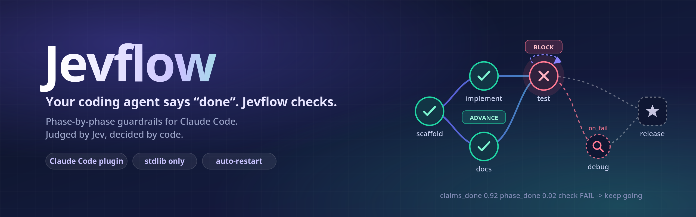
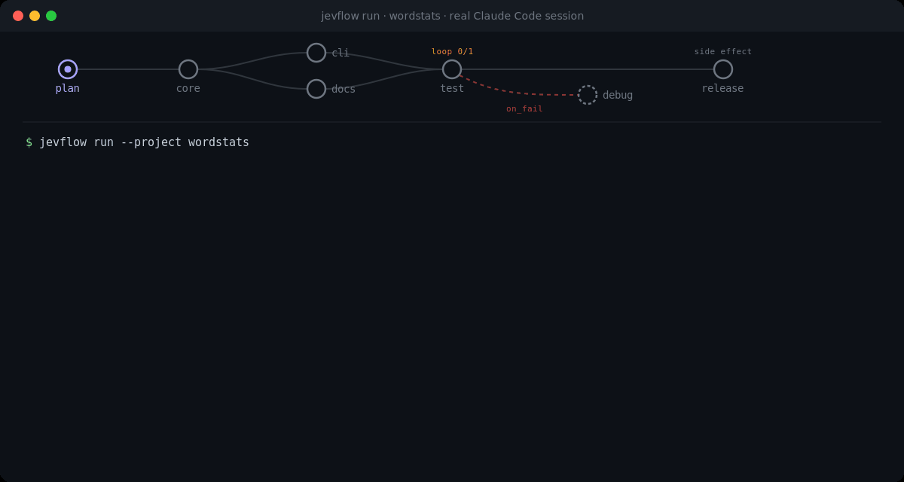
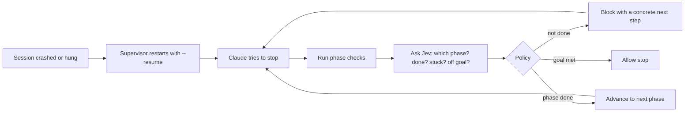

<p align="center">
  <picture>
    <source media="(prefers-color-scheme: dark)" srcset="docs/assets/banner-dark.png">
    <source media="(prefers-color-scheme: light)" srcset="docs/assets/banner-light.png">
    
  </picture>
</p>

<p align="center">
  
  
  
  
  
</p>

---

Long agent sessions fail in boring, predictable ways:

- **They declare victory early.** "All tests pass!" while a test is still red.
- **They lose the plot.** After a context compaction the original goal is gone.
- **They just stop.** A crash, a rate limit or a hung process ends the run with the work half done.

Jevflow fixes all three. You describe the goal as a few phases with a checkable condition each. Every time Claude tries to stop, Jevflow runs your checks, asks [Jev](https://typesafe.ai/blog/introducing-system-one-models-and-jev) (a fast, calibrated judgment model) where the work really stands, and a small, fully tested policy decides: **keep going**, **move to the next phase**, or **you are really done**. If the session dies, a supervisor restarts it where it left off.

## See it work

A real Claude Code session building `wordstats` (a 7-phase flow with parallel phases, a bounded test loop, a held-out release gate and a one-shot release), with Jevflow grading every stop. Halfway through the run was interrupted; a fresh supervisor resumed it from the journal:

<p align="center">
  
</p>

A smaller run (a todo CLI) as `jevflow status` prints it:

```console
$ jevflow status --project .
Goal: Build a tiny Python CLI todo app ...   mode enforce   Done: yes

   PHASE      STATUS   CHECK  NOTES
   scaffold   done     yes
   implement  done     yes    after scaffold
   docs       done     yes    after scaffold
>  test       done     yes    after implement; loop 0/3; on_fail->debug
   debug      pending  yes    branch only

Recent decisions:
  14:43:40  BLOCK       review_band        [scaffold] Continue phase 'scaffold'. Not done yet: todo/cli.py
  14:43:51  ADVANCE     advance            [implement] Phase 'scaffold' is complete. Now work on 'implement'
  14:44:06  ADVANCE     advance            [docs] Phase 'implement' is complete. Now work on 'docs'
  14:44:19  BLOCK       review_band        [docs] Continue phase 'docs'. README does not document done yet
  14:44:50  ADVANCE     review_check_pass  [test] Phase 'docs' is complete. Now work on 'test'
  14:45:14  ALLOW_STOP  goal_complete      [test] Every phase is done and every check passes
```

Six stops, two of them caught too early, goal complete in about 90 seconds. Claude never called a Jevflow command; the hooks did all of it.

## How it works



One rule holds everything together: **Jev informs, code decides.** A probability alone never advances a phase, never marks the goal complete, and never allows a tool call. Your shell checks always outrank the model, and if Jev is unreachable Jevflow falls back to checks only.

## Quick start

You need Claude Code, Python 3.10+, and a [TypeSafe](https://typesafe.ai) API key.

**1. Install**

```sh
git clone https://github.com/Parth1811/JevFlow.git ~/jevflow
mkdir -p ~/.config/jevflow && (umask 077; cat > ~/.config/jevflow/api_key)   # paste key, Ctrl-D
```

**2. Describe the goal** (in an empty project folder, outside `~/jevflow`)

```sh
cd my-project
claude --plugin-dir ~/jevflow
> /jevflow:init Build a CLI todo app in Python with add/list/done commands and tests
```

This writes `.jevflow/flow.json` in `warn` mode, so it only reports what it would do. Review it, then set `"mode": "enforce"`.

**3. Run it**

```sh
claude --plugin-dir ~/jevflow                        # interactive: just ask it to work toward the goal
~/jevflow/hooks/jevflow run --project . --max-turns 40   # unattended, with automatic restarts
```

## A flow is just a few phases

```json
{
  "schema_version": 1,
  "goal": "Build a CLI todo app with add/list/done commands and a passing test suite",
  "mode": "enforce",
  "phases": [
    {"id": "scaffold", "name": "Scaffold", "done_when": "package and entry point exist", "check": "test -f todo/cli.py"},
    {"id": "implement", "name": "Commands", "done_when": "add, list and done work", "check": "python -m todo.cli list"},
    {"id": "test", "name": "Tests pass", "done_when": "the test suite passes", "check": "python -m unittest -q",
     "loop": {"max_iterations": 3, "until": "python -m unittest -q"}, "on_fail": "debug"},
    {"id": "debug", "name": "Debug", "done_when": "the root cause of each failure is fixed"}
  ]
}
```

Phases can form a DAG, loop a bounded number of times, route to a debug phase on failure, split into agent-written sub-steps, or mark an external side effect (like a release tag) that must never run twice. See the [flow reference](docs/REFERENCE.md#flow-format).

## What it catches

| Situation | What Jevflow does |
|---|---|
| Claims "done" while a check fails | Blocks and hands back the failing output |
| A finished phase breaks again | Moves back to that phase |
| Same failure over and over | Tells it to change approach, then asks you |
| Wanders off the goal | Blocks and points back at the goal |
| Context was compacted | Re-injects the goal and phase table |
| Session crashes, hangs or hits a rate limit | Supervisor restarts it (backoff for API errors) |
| Genuinely needs a human | Writes `.jevflow/NEEDS_HUMAN.md` and pauses |

Optional gates, off by default: a Bash risk gate that can only tighten permissions, an injection screen for fetched web content, and checks on subagent and task completion. The full list of 20+ conditions is in the [reference](docs/REFERENCE.md#conditions).

## Watching a run

```sh
~/jevflow/hooks/jevflow status --project .          # phase table and recent decisions
~/jevflow/hooks/jevflow validate --project .        # lint a flow file
~/jevflow/hooks/jevflow ui --project . --open       # live viewer on 127.0.0.1 (read-only)
~/jevflow/hooks/jevflow ui --project . --export run.html   # self-contained HTML snapshot
```

Inside Claude, `/jevflow:status` shows the same table.

| Where you run Claude Code | How to watch |
| --- | --- |
| Terminal | `/jevflow:statusline` adds a line under the prompt: `jevflow ▸ test 4/6 · loop 1/1 · blocks 2/8 · jev 47/80 · last BLOCK loop_continue`. It can sit alongside an existing status line (`statusline --with '<your command>'`). |
| Desktop app (Code tab) | `/jevflow:ui` adds a `jevflow` preview server to `.claude/launch.json`, so the viewer opens in the Browser pane next to the chat. An exported `run.html` also opens there when clicked. |
| Anywhere else | Open an exported snapshot in any browser, or open the viewer page with no data and drop in a `state.json`. |

## Good to know

- **Privacy.** Jev is an external API. By default it sees phase names, check exit codes and output tails, the tail of Claude's last message, and changed file names with line counts, never file contents. Do not point Jevflow at code whose data may not leave your machine. [Details](docs/REFERENCE.md#privacy).
- **Not a sandbox.** `flow.json` checks are shell commands, and the agent runs as your user. Review flow changes like code. [Known limits](docs/REFERENCE.md#limits-and-known-gaps).
- **Cost and speed.** A stop costs one Jev call, typically 0.3 to 0.6 s.
- **Platforms.** Linux and macOS.

## Documentation

- [Reference](docs/REFERENCE.md): every flow field, the stop policy, gates, privacy, limits
- [Design spec](docs/SPEC.md) and [research notes](docs/RESEARCH.md) with measured Jev probabilities
- [Demo log](docs/DEMO.md)

## Development

```sh
python3 -m unittest discover -s tests     # 280 tests, stdlib only; the live Jev test skips without a key
```

## License

[MIT](LICENSE)
