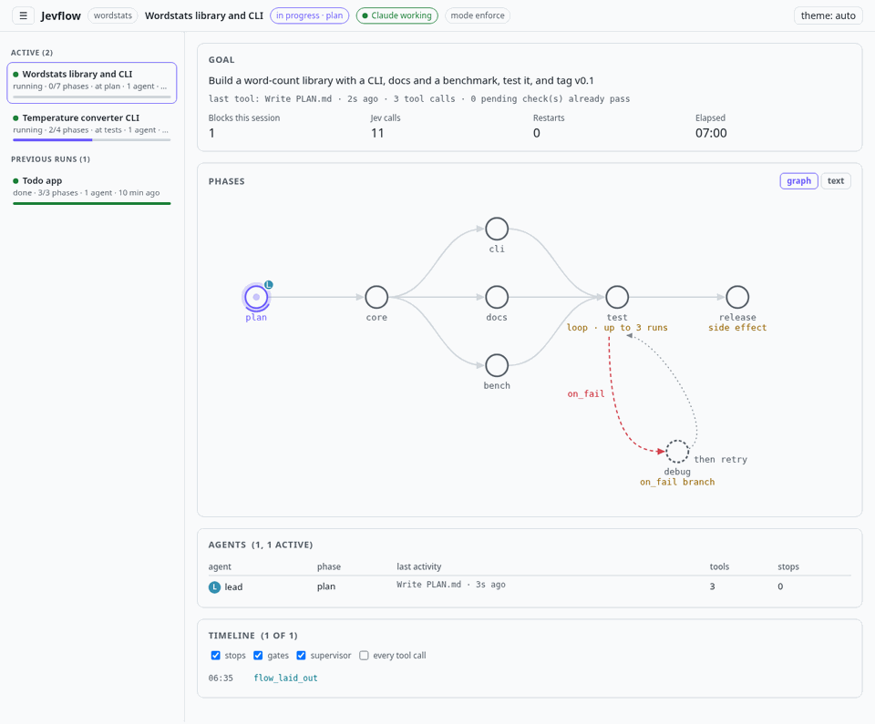
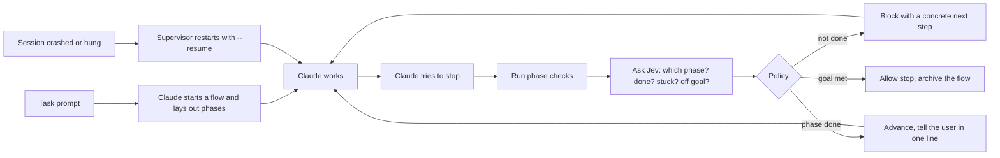

<p align="center">
  <picture>
    <source media="(prefers-color-scheme: dark)" srcset="docs/assets/banner-dark.png">
    <source media="(prefers-color-scheme: light)" srcset="docs/assets/banner-light.png">
    
  </picture>
</p>

<p align="center">
  
  
  
  
  
</p>

---

AI coding agents are great at starting work and bad at finishing it:

- **They declare victory early.** "All tests pass!" while a test is still red, or the README never got written.
- **They drift.** A long session wanders off the goal, or loses it entirely after a context compaction.
- **They trip over each other.** Two sessions or a few subagents in one repo, and nobody knows who is doing what.
- **They just stop.** A crash, a rate limit or a hung process ends the run half done.

**Jevflow** is a Claude Code plugin that keeps Claude accountable. For any real task, Claude lays the work out as a small plan of phases, each with a definition of done and a check. Every time Claude tries to stop, Jevflow runs the checks and asks [Jev](https://typesafe.ai/blog/introducing-system-one-models-and-jev), a fast, calibrated judgment model, where the work really stands: is this phase finished, is Claude stuck, off the goal, or claiming done too early? A small, fully tested policy then decides: **keep going**, **move to the next phase**, or **you are really done**. Several agents can share one plan, every flow in a project is remembered, and a live viewer shows it all.

## See it work

Three agents on one flow in the live viewer. A lead session builds the CLI while a docs subagent and a second session take the docs and the benchmark in parallel; then the test loop, the release tag and goal complete. The sidebar keeps every flow in the project, running and finished.

<p align="center">
  <picture>
    <source media="(prefers-color-scheme: dark)" srcset="docs/assets/multi-agent-dark.gif">
    <source media="(prefers-color-scheme: light)" srcset="docs/assets/multi-agent.gif">
    
  </picture>
</p>

And a replay of a real Claude Code session building `wordstats` (7 phases: parallel phases, a bounded test loop, a held-out release gate, a one-shot release), interrupted halfway and resumed from the journal:

<p align="center">
  
</p>

## Quick start

You need [Claude Code](https://docs.claude.com/en/docs/claude-code), Python 3.10+, and a Jev API key from [TypeSafe](https://typesafe.ai).

**1. Add the plugin to Claude Code**

```sh
claude plugin marketplace add Parth1811/JevFlow
claude plugin install jevflow@jevflow
```

Inside Claude Code the same thing is `/plugin marketplace add Parth1811/JevFlow`, then `/plugin install jevflow@jevflow`.

**2. Set up your Jev API key**

Claude Code asks for the key when you enable the plugin. To set or change it later, open `/plugin`, pick **jevflow** and choose **Configure**. The key is kept in your system's secure credential store, not in `settings.json`, and only Jevflow's hooks receive it. For the standalone `jevflow run` supervisor, `export JEV_API_KEY=...` works too. Keep the key out of your repo. Without a key Jevflow still runs, on your checks only.

**3. Use Claude as usual**

Open `claude` in any project and give it a real task, for example *"build a small CLI that converts temperatures, with tests and a README"*. Claude starts a tracked flow itself, gives it a name, lays out the phases and gets to work. Questions and one-line edits are left alone.

**4. Watch it (optional)**

```sh
jevflow ui --open       # live viewer: every flow, its phases and its agents
jevflow status          # the same, as text
```

Inside Claude: `/jevflow:ui`, `/jevflow:status`, `/jevflow:statusline`. The `jevflow` command is linked into `~/.local/bin` by your first Claude session (or run `jevflow install-cli`).

**Update:** `claude plugin marketplace update jevflow && claude plugin update jevflow@jevflow`, then restart Claude.

## How it works



One rule holds it together: **Jev informs, code decides.** A probability alone never advances a phase, never marks the goal complete, and never allows a tool call. Checks always outrank the model: a failing check always blocks, and a passing check plus a strong "phase done" from Jev moves on without extra round trips. If Jev is unreachable, Jevflow falls back to checks only.

Every stop is journaled in `.jevflow/`, so a crashed or compacted session picks up exactly where it was: the goal and phase table are re-injected, and side effects like a release tag are never repeated.

## A flow is just a few phases

Claude writes this for you when it starts a flow; you can also write or edit it by hand (`/jevflow:init <goal>`).

```json
{
  "schema_version": 1,
  "title": "Todo CLI",
  "goal": "Build a CLI todo app with add/list/done commands and a passing test suite",
  "mode": "enforce",
  "phases": [
    {"id": "scaffold", "name": "Scaffold", "done_when": "package and entry point exist", "check": "test -f todo/cli.py"},
    {"id": "implement", "name": "Commands", "done_when": "add, list and done work", "check": "python -m todo.cli list"},
    {"id": "docs", "name": "README", "done_when": "README shows usage", "check": "grep -q Usage README.md",
     "depends_on": ["scaffold"]},
    {"id": "test", "name": "Tests pass", "done_when": "the test suite passes", "check": "python -m unittest -q",
     "depends_on": ["implement", "docs"],
     "loop": {"max_iterations": 3, "until": "python -m unittest -q"}, "on_fail": "debug"},
    {"id": "debug", "name": "Debug", "done_when": "the root cause of each failure is fixed"}
  ]
}
```

- **Dependencies** (`depends_on`) make a DAG, so independent phases can run in parallel.
- **Bounded loops** (`loop`) re-run a check up to N times; `max_iterations` counts runs, passing or failing.
- **Failure branches** (`on_fail`) route to a debug phase when a loop runs out, then back.
- **Side effects** (`side_effect: true`) mark one-shot actions like tagging or deploying; they never run twice, even after a crash.
- **Dynamic phases** (`dynamic: true`) let Claude split a phase into its own sub-steps.

Every field is in the [flow reference](docs/REFERENCE.md#flow-format).

## Many flows, many agents

- **Every task is remembered.** Each flow lives in `.jevflow/flows/<date>-<name>/` and moves to `.jevflow/done/<id>/` with a `SUMMARY.md` when it finishes. `jevflow flows` lists them all, and `status`, `ui`, `validate` and `run` take `--flow ID`.
- **Parallel sessions stay separate.** Each Claude session is bound to its own flow, so two sessions in one repo track two flows without mixing them up.
- **Or they share one.** A second session runs `jevflow join <flow id>`; any agent says what it is on with `jevflow claim <phase> --as <role>`. Subagents are tracked by their own id. The viewer and `status` show who is on which phase.
- **Meaningful names.** Claude names each flow (`start --name temp-converter-cli`, `"title": "Temperature converter CLI"`), and that name shows everywhere.

Want every task-like prompt to start a flow, without Claude deciding? `jevflow auto on --project .` (or `/jevflow:auto on`). Put `#nojev` in a prompt to skip it, `#jev` to force it.

## What it catches

| Situation | What Jevflow does |
|---|---|
| Claims "done" while a check fails | Blocks and hands back the failing output |
| Check passes but Jev is unsure | Holds briefly with a note; after two passing stops in a row, the check decides |
| A finished phase breaks again | Moves back to that phase |
| Same failure over and over | Tells it to change approach, then asks you |
| Wanders off the goal | Blocks and points back at the goal |
| Context was compacted | Re-injects the goal and phase table |
| Block budget runs out | Marks every phase whose check already passes as done (completing the flow if that finishes it), then stops; your next message starts a fresh budget |
| Session crashes, hangs or hits a rate limit | Supervisor restarts it (backoff for API errors) |
| Genuinely needs a human | Writes `NEEDS_HUMAN.md` and pauses |

Optional gates, off by default: a Bash risk gate that can only tighten permissions, an injection screen for fetched web content, and checks on subagent and task completion. The full list of conditions is in the [reference](docs/REFERENCE.md#conditions).

## Watching a run

**In Claude.** Every phase change prints one line:

```text
[jevflow] Temperature converter CLI: ✓ package → cli (1/4 done) · Phase 'package' is complete.
```

`/jevflow:statusline` adds a status line under the prompt: `jevflow ▸ test 4/6 · loop 1/3 · blocks 2/6 · jev 47/200 · last BLOCK loop_continue`. It can sit alongside an existing status line (`statusline --with '<your command>'`).

**In the viewer** (`jevflow ui --open`, read-only, 127.0.0.1 only):

- every flow in the project, active ones and previous runs, one click to switch (the URL keeps `#flow=<id>`)
- the phase graph, with a spinner on each phase an agent is working on, or the same text as `jevflow status`
- click a phase for its definition of done, check, loop runs and last decision
- the agents on each phase, with their latest tool and file
- the decision timeline, and a light, dark or system theme

`jevflow ui --export run.html` writes a self-contained snapshot, previous runs included. In the Claude Code desktop app, `/jevflow:ui` adds a preview server so the viewer opens in the Browser pane next to the chat.

**As text:**

```console
$ jevflow status
Flow: Temperature converter CLI
Goal: Build a small Python package that converts temperatures, with a CLI, tests and a README
Flow version 1, mode enforce. Done: no.

   PHASE    STATUS   CHECK  AGENTS         NOTES
   package  done     yes    -
>  cli      active   yes    claude 4f2a9c  after package
   tests    pending  yes    -              after package,cli
   docs     pending  yes    -              after package,cli

Blocks this session: 1/6  Restarts: 0/5  Jev calls: 4/200  Started: 2026-09-25 23:22:59Z
```

## Running unattended

For long jobs, hand Claude a flow and walk away: `jevflow run --project .` launches Claude, restarts it with `--resume` after a crash, hang or rate limit, and stops when the goal is complete, a limit is reached, or a human is needed.

## Good to know

- **Privacy.** Jev is an external API. By default it sees phase names, check exit codes and output tails, the tail of Claude's last message, and changed file names with line counts, never file contents. Do not point Jevflow at code whose data may not leave your machine. [Details](docs/REFERENCE.md#privacy).
- **Not a sandbox.** Checks are shell commands, and the agent runs as your user. Review flow changes like code. [Known limits](docs/REFERENCE.md#limits-and-known-gaps).
- **Coordination is visible, not locked.** Agents can see each other's claims, but nothing stops two from claiming the same phase.
- **Cost and speed.** A judged stop is one Jev call, typically 0.3 to 0.6 s. Stops the checks can decide alone skip Jev.
- **Platforms.** Linux and macOS.

## Documentation

- [Reference](docs/REFERENCE.md): every flow field, the stop policy, gates, privacy, limits
- [Design spec](docs/SPEC.md) and [research notes](docs/RESEARCH.md) with measured Jev probabilities
- [Demo log](docs/DEMO.md)

## Development

```sh
python3 -m unittest discover -s tests     # 356 tests, stdlib only; the live Jev test skips without a key
claude --plugin-dir ~/jevflow              # load a checkout without installing
```

## License

[MIT](LICENSE)
